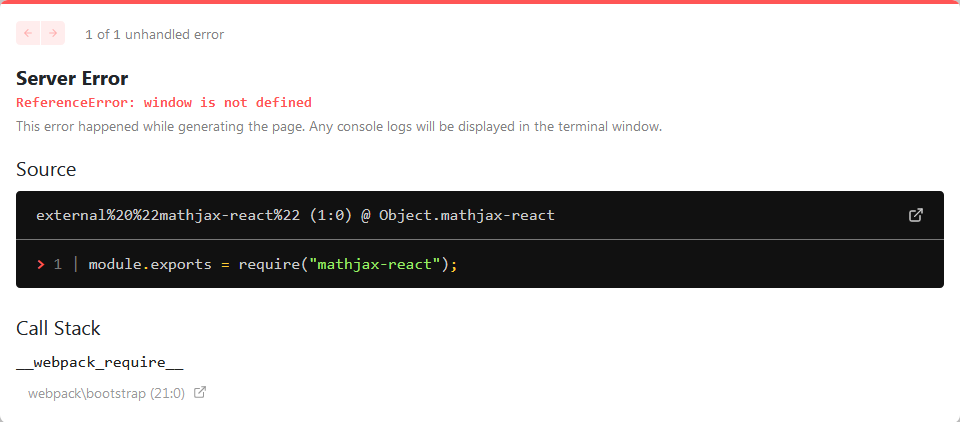

# Next.js-MathJax issue

This package contains node.js project that reproduces the issue with `next` npm package while using `MathComponent` of `mathjax-react`.

## Prerequisites

- Node.js ^14.15.1
- `npm` ^6.14.1

## Steps to reproduce

- Run `npm i` to install dependencies.
- Run `npm run dev` to start development server.
- Open `localhost:3000/` in browser.
- Observe the error message in the browser:
  
- Go to `./pages/index.tsx` and comment the 9th line. Text ``<MathComponent tex={String.raw`\vec{a}`}/>`` should be replaced with ``{/* <MathComponent tex={String.raw`\vec{a}`}/> */}``.
- Observe that error has disappeared from browser.
- Uncomment the 9th line restoring the initial value (``<MathComponent tex={String.raw`\vec{a}`}/>``).
- Observe that there are no errors in the browser and formula `\vec{a}` shows properly:
  
